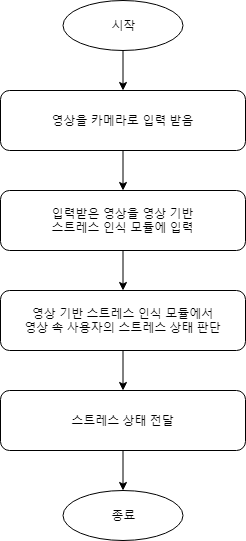
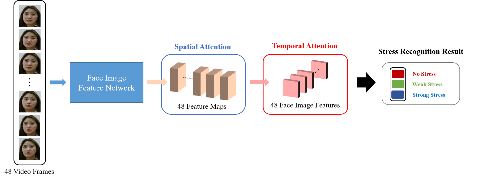

[Flagship] Image based stress recognition module
======================================

#### Note

> (2020/04/29) 4월 마스터 버전이 업데이트 되었습니다.
>
> (2020/10/15) 딥 러닝 프레임워크를 Pytorch에서 Tensorflow로 변경하여 업데이트 하였습니다.
>
> (2020/10/30) Face Recognition Feature를 함께 결과로 반환하는 형태로 업데이트 하였습니다.
>
> (2020/11/03) 다른 API에 적용하기 쉽도록 여러 함수를 작성한 파일을 업데이트 하였습니다.
>
> (2020/11/16) 학습한 모델이 다른 환경에서 동작하지 않는 현상이 발생하여 업데이트 하였습니다.
>
> (2021/01/08) 1월 파이널 버전이 업데이트 되었습니다.

#### System/SW Overview

> 
> 

***

#### How to Install

```
pip install -r requirements.txt
```

***

#### Main requirement

> * python 3.5.6
> * tensorflow-gpu 1.12.0

***

#### Network Architecture and features

> 
> * **Model:**
> * CNN with Spatial, Temporal Attention for image based stress recognition.
> * Multi-attention is used for increasing performance.
> * ...
> * **Face Image Feature:**
> * Mobile FaceNet and Resnet-18 was used as the base cnn model.
> * Spatial Attention was used to extract more improved cnn features.
> * Temporal Attention was used to weight the cnn feature of the critical frame.
> * ...
> * **Metrics:**
> * Accuracy
> * Ranking metrics: Accuracy is obtained by dividing the number of clips that correctly estimate the stress level by the total number of clips.
> * ...

***

#### Quick start

* 2가지 방법을 사용할 수 있다.

        1. command prompt를 이용하는 방법
> * Step1. SR_server.py 파일의 아래 부분에 IP주소를 실행 환경에 맞게 설정한다.
> * Step2. 서버에서 아래 명령을 실행한다. 
> ```
> python SR_server.py
> ```
> * Step3. SR_client.py 파일의 윗 부분에 IP주소를 실행 환경에 맞게 설정하고 테스트하고자 하는 비디오의 경로를 입력한다.
> * Step4. 클라이언트에서 아래 명령을 실행한다. 
> ```
> python SR_client.py
> ```

        2. Web 상에서 이용하는 방법
> * Step1. SR_server_web.py 파일의 아래 부분에 IP주소를 실행 환경에 맞게 설정한다.
> * Step2. 서버에서 아래 명령을 실행한다.
> ```
> python SR_server_web.py
> ```
> * Step3. 동일 컴퓨터에서 실행한다면 http://127.0.0.1:5000/, 다른 컴퓨터에서 실행한다면 http://IP주소:포트번호/에 접속한다.
> * Step4. "Try it out"을 누른 후 나오는 화면에서 "video_path" 항목에 비디오 경로를 입력한 후 아래의 "Execute"를 누른다.

***

#### HTTP-server API description

> * Path
> ```
> 5Y-M1_2-image_based_stress_recognition/SR_server.py
> ```

> * JSON parameters are:

> |Parameter|Type|Description|
> |---|---|---|
> |video_path|string|The path where the video to recognize stress is stored, Video files must have the extension mp4|

> * Request
> ```
> POST 5Y-M1_2-image_based_stress_recognition/SR_server.py
> data: {
> 'video_path': 'F:/Python/5Y-M1_2-image_based_stress_recognition/Data/paulyongju@yonsei.ac.kr-2.mp4'
> }
> ```

> * Response OK
> ```
> 200 OK
> {
>  '100004': 0 or 1 or 2 (0: no stress, 1: weak stress, 2: strong stress)
>  '100005': 128-dimensional feature vectors (for Face Recognition, float32)
> }
> ```

***

####  Repository overview

* 폴더 및 파일의 구조 및 역할(기능)을 설명한다.

> e.g. 
> * `Data/` - 샘플 데이터, 얼굴 랜드마크 검출기 파일, 학습할 때 사용되는 파일이 저장되어 있음
> * `etc/` - 알고리즘 설명 이미지들이 저장되어 있음
> * `checkpoint/` - 학습된 모델이 저장되어 있음, 학습할 때 모델이 저장되는 경로
> * `mtcnn/` - 얼굴 검출할 때 사용되는 코드 및 파일들이 저장되어 있음
> * `APITestData/` - API가 정상적으로 작동하는지 확인하기 위한 Data가 저장되어 있음
> * `requirements.txt` - Python의 패키지 환경이 저장되어 있는 파일
> * `SR_client.py` - 클라이언트에서 실행하는 파일
> * `SR_ResNet.py` - 모델이 저장되어 있는 파일
> * `SR_server.py` - command prompt에서 사용하기 위해 서버에서 실행하는 파일
> * `SR_server_code.py` - 서버에서 사용하는 함수들이 저장되어 있는 파일
> * `SR_server_web.py` - Web 상에서 테스트하기 위해 서버에서 실행하는 파일
> * `SR_test.py` - 학습한 모델을 테스트하는 파일
> * `SR_train.py` - 모델을 학습할 때 사용하는 파일
> * `SR_utils.py` - 모델을 학습 및 테스트할 때 사용하는 기타 함수들이 저장되어 있는 파일
> * `SR_APITest_Script.py` - API가 정상적으로 작동하는지 APITestData 내 Data로 Test하는 파일
> * `SR_API_function.py` - 다른 API에 적용하기 쉽도록 pre-processing, model loading, feature extraction, prediction 기능을 가진 함수들을 모아놓은 파일

***
